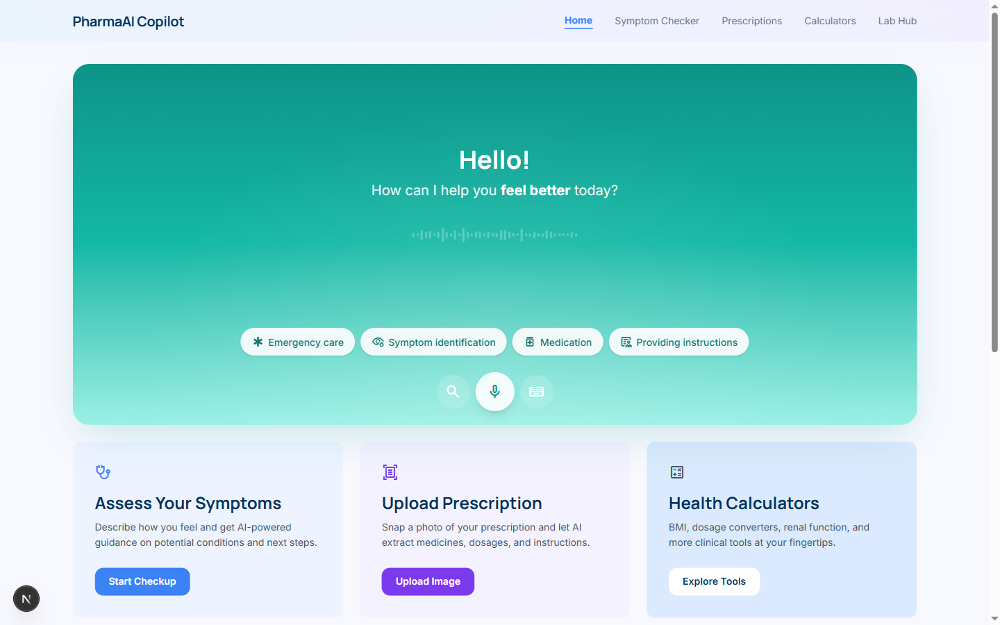
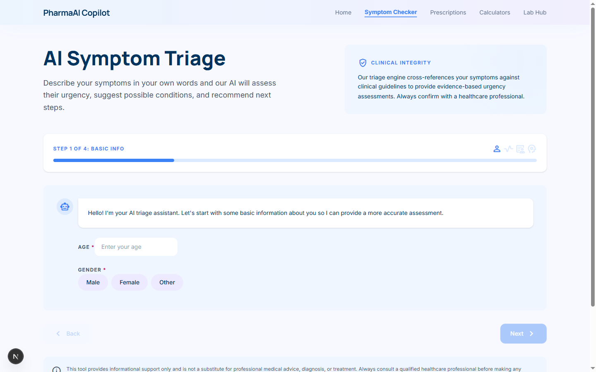
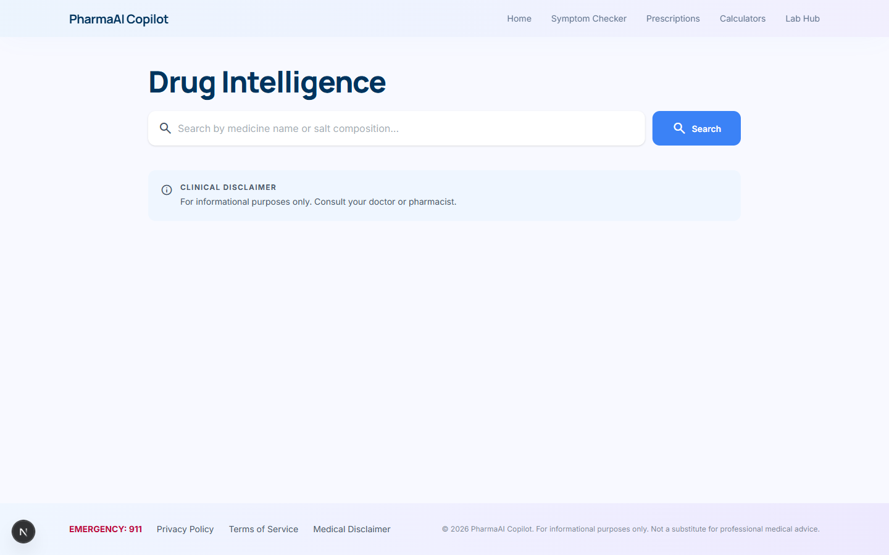
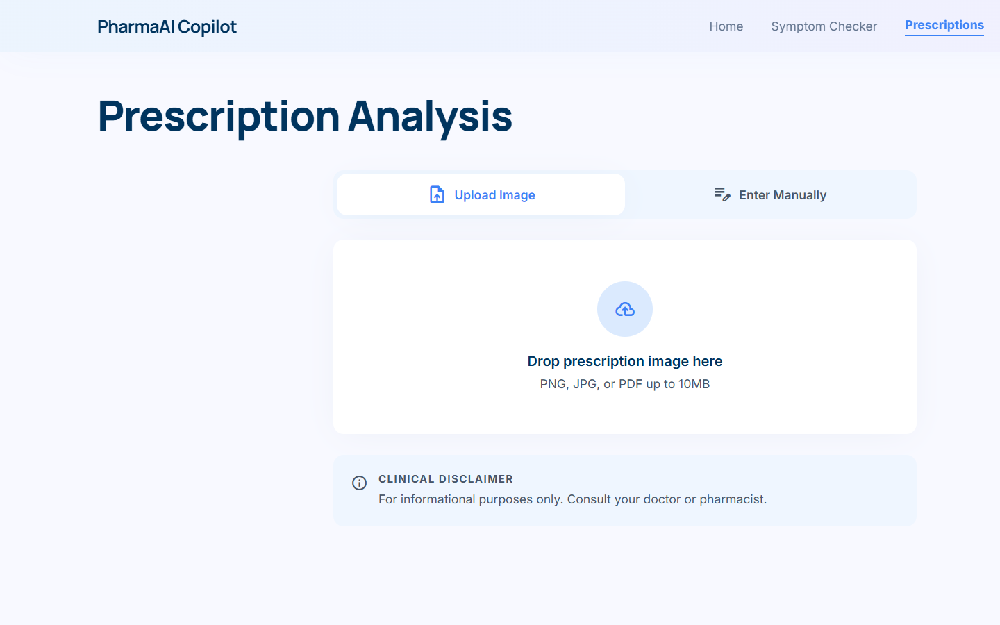
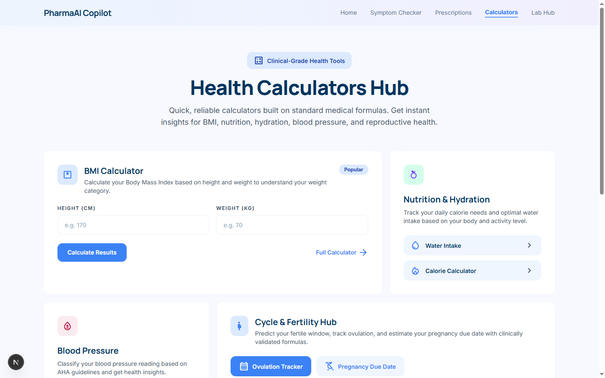

# 🏥 Med 360 Copilot — Your AI Clinical Sanctuary

> An AI-powered medical SaaS platform for symptom triage, prescription analysis, drug intelligence, lab report analysis, and health calculators. Built with Next.js 16, React 19, and multi-model AI support.

## ✨ Features

- 🤖 **AI Chat Copilot** — Voice + text conversational AI for health queries
- 🩺 **Symptom Triage** — 4-step AI assessment with urgency levels + doctor booking via Marham.pk
- 💊 **Prescription Analysis** — Upload prescriptions, get drug info, interactions, alternatives
- 🔬 **Drug Intelligence** — Search any medicine for dosage, mechanism, side effects
- 🧪 **Lab Report Analysis** — Upload lab reports for AI-powered interpretation
- 📊 **Health Calculators** — BMI, Blood Pressure, Pregnancy, Ovulation, Water, Calories
- 📱 **Share Results** — Send results via WhatsApp or SMS
- 🎨 **Modern UI** — Glassmorphism, micro-interactions, gradient design system

## 🛠 Tech Stack

| Layer | Technology |
|-------|-----------|
| Frontend | Next.js 16.1.6, React 19, Tailwind CSS v4 |
| UI | shadcn/ui, Framer Motion, Material Symbols |
| AI Backend | Claude API / OpenAI API / Google Gemini (interchangeable) |
| Language | TypeScript 5 |
| Fonts | Manrope (headlines), Inter (body) |

## 🚀 Quick Start

```bash
# 1. Clone the repo
git clone https://github.com/mohammedrehman33/med-360-copilot.git
cd med-360-copilot

# 2. Copy environment config
cp .env.example .env

# 3. Fill in at least ONE AI API key in .env
#    (Anthropic, OpenAI, or Google Gemini)

# 4. Install dependencies
npm install

# 5. Start the dev server
npm run dev

# 6. Open in browser
open http://localhost:3000
```

## 🔑 Environment Variables

| Variable | Required | Description |
|----------|----------|-------------|
| `ANTHROPIC_API_KEY` | At least one | Anthropic Claude API key |
| `OPENAI_API_KEY` | At least one | OpenAI API key |
| `GOOGLE_API_KEY` | At least one | Google Gemini API key |
| `CLAUDE_MODEL` | No | Override default Claude model |
| `OPENAI_MODEL` | No | Override default OpenAI model |
| `GEMINI_MODEL` | No | Override default Gemini model |
| `PORT` | No | Server port (default: 3000) |

> **Note:** You need at least ONE AI provider key set. The app auto-detects which is available.

## 📁 Project Structure

```
src/
├── app/
│   ├── page.tsx                 # Landing page
│   ├── layout.tsx               # Root layout
│   ├── globals.css              # Global styles
│   ├── dashboard/               # Main dashboard
│   ├── triage/                  # Symptom triage flow
│   ├── drugs/                   # Drug search & intelligence
│   ├── analyze/                 # Prescription analysis
│   ├── lab-report/              # Lab report upload & analysis
│   ├── lab-tests/               # Lab test search
│   ├── calculators/             # Health calculators
│   │   ├── bmi/
│   │   ├── blood-pressure/
│   │   ├── pregnancy/
│   │   ├── ovulation/
│   │   ├── water/
│   │   └── calories/
│   └── api/                     # API routes
│       ├── chat/                # AI chat endpoint
│       ├── triage/              # Symptom triage endpoint
│       ├── drugs/[name]/        # Drug lookup
│       ├── analyze-prescription/# Prescription analysis
│       ├── check-interactions/  # Drug interaction check
│       ├── find-alternatives/   # Drug alternatives
│       ├── lab-reports/         # Lab report analysis
│       ├── lab-tests/search/    # Lab test search
│       ├── generate-guide/      # Health guide generation
│       ├── prescriptions/       # Prescription management
│       └── analysis/[id]/       # Analysis retrieval
├── components/
│   ├── chat/                    # Chat UI components
│   ├── layout/                  # Layout components (navbar, sidebar)
│   └── ui/                      # shadcn/ui primitives
├── lib/
│   ├── agents/                  # AI provider abstraction layer
│   ├── data/                    # Static data & constants
│   ├── db/                      # Database utilities
│   ├── constants.ts             # App-wide constants
│   ├── store.ts                 # State management
│   └── utils.ts                 # Utility functions
└── types/
    ├── index.ts                 # Shared TypeScript types
    └── speech.d.ts              # Web Speech API types
```

## 🤖 AI Provider Support

| Provider | Default Model | Free Tier | Notes |
|----------|--------------|-----------|-------|
| **Claude** (Anthropic) | claude-sonnet-4-6 | No (pay-as-you-go) | Best quality, recommended |
| **OpenAI** | gpt-4o-mini | No (pay-as-you-go) | Good balance of speed/quality |
| **Google Gemini** | gemini-2.0-flash | Yes (generous free tier) | Great for getting started |

The app auto-detects which API key is available and uses that provider.

**Priority order:** Claude → OpenAI → Gemini

## 📸 Screenshots

### Home — AI Chat Copilot


### Symptom Triage


### Drug Intelligence


### Prescription Analysis


### Health Calculators


## 🚢 Deployment

See [DEPLOYMENT.md](./DEPLOYMENT.md)

## 🏗 Architecture

See [ARCHITECTURE.md](./ARCHITECTURE.md)

## 🤝 Contributing

See [CONTRIBUTING.md](./CONTRIBUTING.md)

## 📄 License

MIT — see [LICENSE](./LICENSE)

## ⚠️ Medical Disclaimer

This is an AI tool for **informational purposes only**. It is **not a substitute** for professional medical advice, diagnosis, or treatment. Always seek the advice of a qualified healthcare provider with any questions regarding a medical condition. Never disregard professional medical advice or delay seeking it because of something provided by this application.
